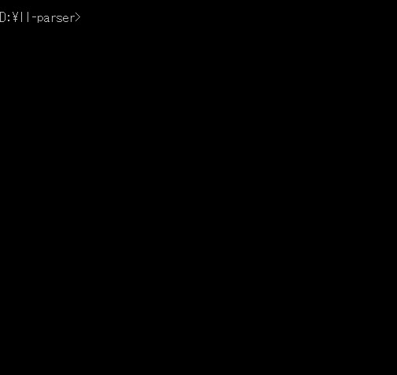
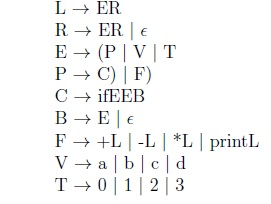
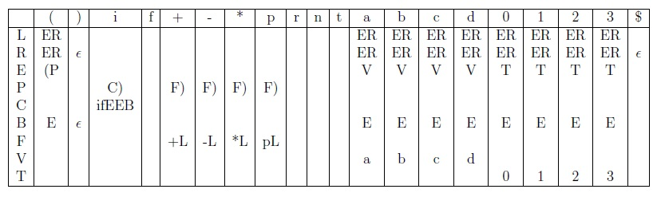

# LL(1) Table Driven Parser

The LL(1) table driven parser is a program written in Python3 that parses prefix arithmetic expressions using a small subset of a mockup programming language.

## Key learning

- To understand the foundations of computational models, in particular Automata Theory.
- To emulate the parsing operation of compilers in programming languages, including forms of syntax checks.

## Goal and Requirements

I have opted to using Python as it is flexible in its manipulation of data, hence making it easier to use a hard coded parse table. The parser program uses a hard coded parse table included as a separate file (grammar.py) to keep the main parsing file clean. 

### Input
- The program's input is a file containing a string of characters to test its validity. 

Example
```
(print (+ 3 2))
```
### Output
- It will then print a trace of execution, showing the steps followed by the program as it performs a left-most derivation on a parse table derived from a grammar G'.
- After parsing the file, it will either print `ACCEPTED` or `REJECTED` depending if the string could be derived from the given grammar.
- If there is a symbol in the input string which is not a terminal from the grammar, the program will out `ERROR_INVALID_SYMBOL`.

### Error Recovery Feature
As many compilers have either ways of checking of syntax errors and even suggesting corrections, I have implemented a simple error recovery feature.

If a second command line arugment `error` is given, then instead of rejecting a string that is invalid, it will make suggestions in how to correct it. The user is to choose one of the options, from which the program will continue the parse.

## Installation

1. Download this project as a zip and extract it.

## Usage

1. The first command line arugment should specify the filename of the string to test.
2. (OPTIONAL) Provide a second command line argument ```error``` to turn on the error recovery feature. 
3. Run the parser.py script.

**Example**



## Appendices

**Grammar G'**



**Parse Table**

